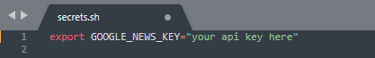
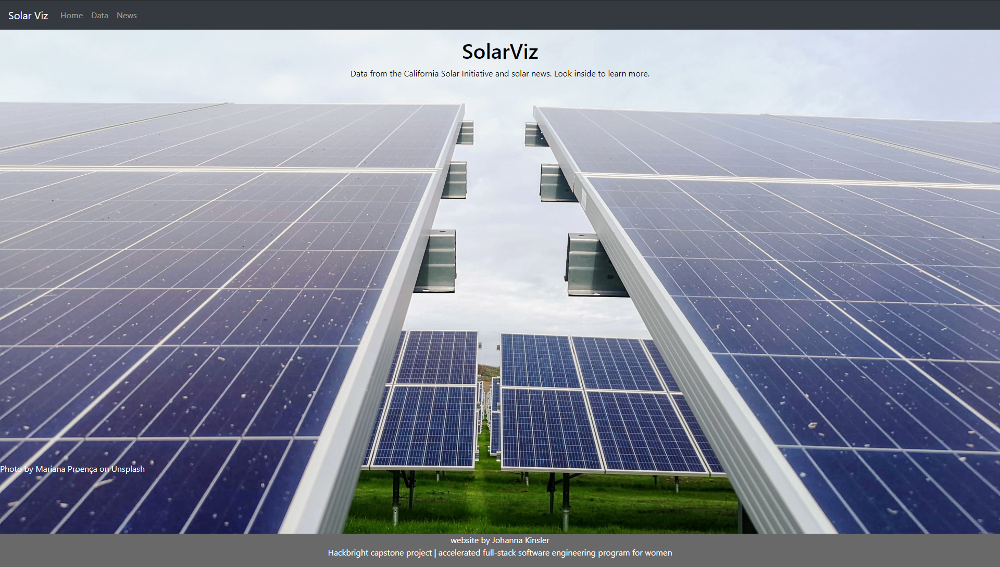
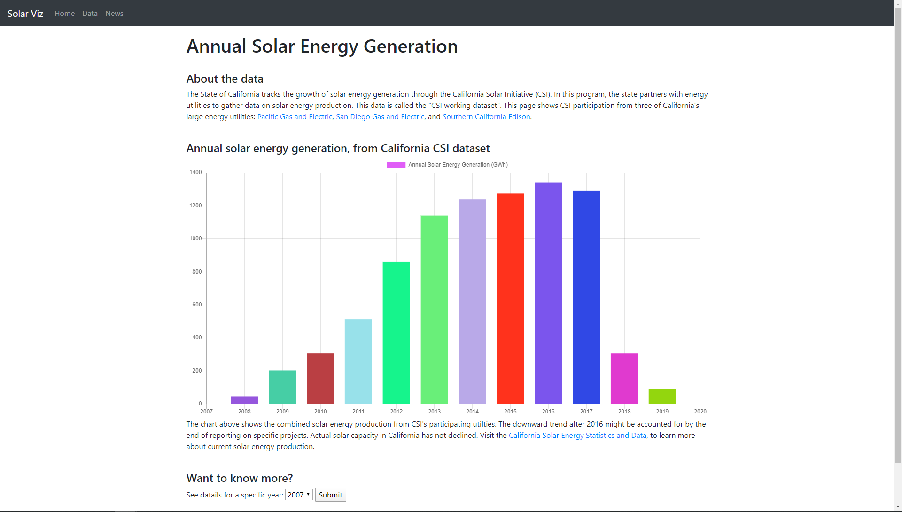
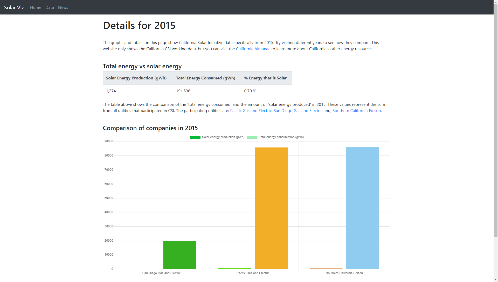
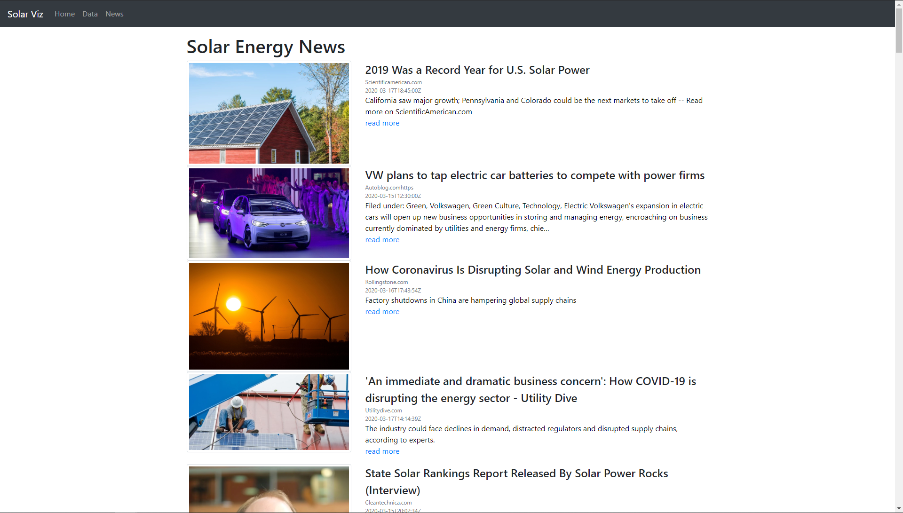

# SolarViz

SolarViz is a full stack web application that informs users about solar energy production and news.

SolarViz has a custom web interface that displays data from the California Solar Initiative, which is an energy tracking and incentive program run by the state. The site contains dynamically generated graphs that users can review to understand broad trends in solar energy production. Users can select filters on the larger data set to see specific information from years and companies. 

SolarViz also displays current news related to solar energy and utilities. Users can see article descriptions and click them to go to the original news source. 

This project was made at Hackbright Academy in San Francisco over four weeks in February and March 2020.

### Contents
* [Technologies](#techstack)
* [Installation](#installation)
* [Features](#features)
* [Features for Version 2.0](#futurefeatures)
* [About The Developer](#aboutme)

## <a name="techstack"></a>Technologies

Tech Stack: Python, PostreSQL, SqlAlchemy, Flask, Python .csv library, HTML, JavaScript, asynchronous JavaScript (Ajax ), bootstrap, css, Chart.js, unittest 
<br><br>
APIs: Google News

## <a name="installation"></a>Installation

### Prerequisites

The following must be installed to run SolarViz:

- Python3
- PostgreSQL

- API key for GoogleNews

### Run SolarViz on your local computer

Clone repository:
```
$ git clone https://github.com/JKinsler/Solar_Viz.git
```
Create and activate a virtual environment inside your SolarViz directory:
```
$ virtualenv env --always-copy  
$ source env/bin/activate
```
(Mac and Linux users use 'virtualenv env')
<br><br>
Install dependencies:
```
$ pip install -r requirements.txt
```
Get a Google News API key:
<a href="https://newsapi.org/s/google-news-api"> Google News API </a>
<br><br>
Create a file called **secrets.sh** and add your Google News API key there: <br> 

<br><br>
Source the API key:
```
$ source secrets.sh
```
Create a database called 'solar_viz':
```
$ createdb solar_viz
```
Import the tables and data using **solar_viz.sql**:
```
$ psql solar_viz < solar_viz.sql
```
(Alternatively, you can run **seed.py** interactively in the terminal. This will create the database tables and populate them. Be prepared to wait up to 45minutes for this file to run) 
```
$ python3 -i seed.py
```
Run the app from the command line:
```
$ python3 server.py
```
<br><br>
## <a name="features"></a>Features

#### Homepage
The landing page includes a brief description of the app and links to the features. 

<br>

#### Data
Users are shown a graphical representation of solar energy production by year.


To see more information on a particular year, users can select 'year' from the drop-down menu and click 'Submit.'

#### Year
More details are shown about the year that the user selected. There are additional graphical representations of solar energy production, but this time the information is grouped by utility company.



#### News
Popular articles about solar energy news and utilities are shown here. Users can click any article to go to the original news source.<br>


## <a name="futurefeatures"></a>Features for Version 2.0

* Automatically update the raw data files so they stay current with the latest version available from the California Solar Initiative.
* In the 'Data' route, allow users to filter production data for a particular time period. E.g. user could select Dec 2007 to Jan 2008 and see production for that time period.
* In the 'Year' route, enable users to download the production and consumption totals as an excel file.
* Enable users to see which cities in California produce the most solar energy by overlaying solar energy generation values on a map using D3. 

## <a name="aboutme"></a>About the Developer

SolarViz creator, Johanna Kinsler, is a former automotive engineer turned software engineer. Johanna made SolarViz to practice her full stack software engineering skills and also learn more about data visualization and renewable energy. She can be found on [LinkedIn](https://www.linkedin.com/in/johanna-kinsler-76562463/) and on [Github](https://github.com/JKinsler).
